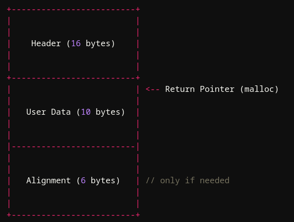
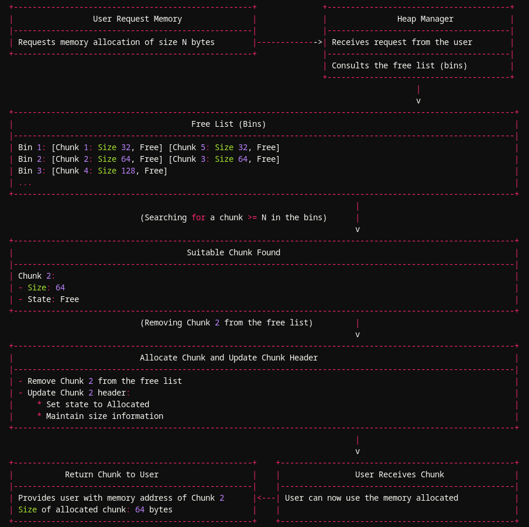
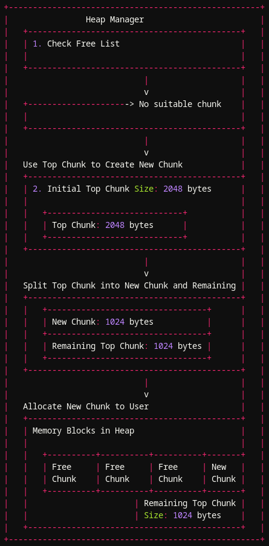
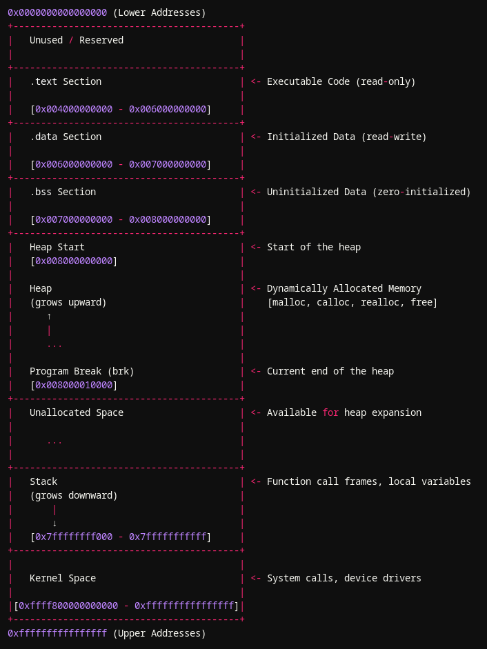
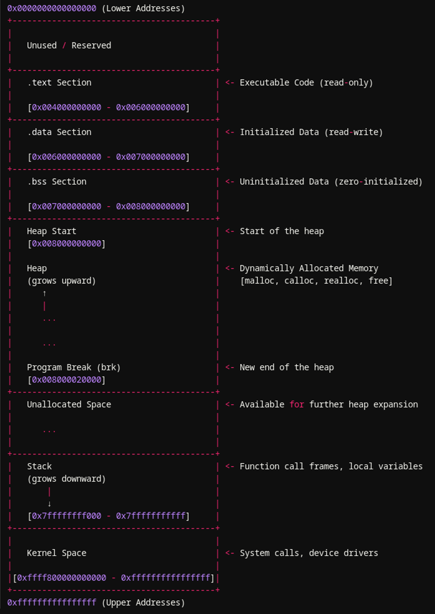
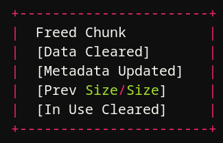
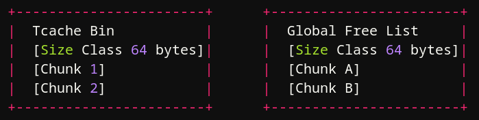
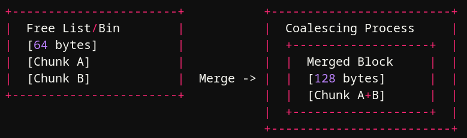

### Intro

In the first part I covered the allocator building blocks: arenas, chunks, metadata, and bins. In this post I want to connect those pieces into the actual allocation and free paths you will see while debugging a process or reading glibc source.

The most important thing to keep in mind is that glibc does not have one single "malloc path" or one single "free list". The path depends on request size, tcache state, arena state, and the exact glibc version.

---

### Size Accounting Before Any Allocation Path

When you call `malloc(0x10)`, glibc is not simply looking for a raw 16-byte region. It first converts your request into an **internal chunk size** using alignment and minimum-size rules.

In current glibc source this happens through `request2size(req)`:

```c
#define request2size(req)                                         \
  (((req) + SIZE_SZ + MALLOC_ALIGN_MASK < MINSIZE)  ?             \
   MINSIZE :                                                      \
   ((req) + SIZE_SZ + MALLOC_ALIGN_MASK) & ~MALLOC_ALIGN_MASK)
```

On a typical 64-bit build:

- requested size: `0x10`
- internal chunk size after `request2size`: `0x20`

That is the number you should track while reasoning about chunk placement. It is more accurate than saying "glibc adds 16 bytes of metadata and then 6 bytes of padding". The allocator uses size macros, not a one-line textbook formula.

> **Allocated chunk example**



After the allocator chooses a chunk, it returns a pointer to the user-data area inside that chunk.

---

### Where Heap Memory Comes From

Before talking about allocation paths, we need to answer a simpler question: where does the allocator get memory in the first place?

glibc can obtain memory from the kernel in two major ways:

- by extending the traditional heap region with `brk`/`sbrk`
- by creating separate mappings with `mmap`

For the main arena, glibc often grows heap-backed memory with `brk`/`sbrk`. Large allocations may be satisfied with `mmap`, and non-main arenas can also rely on `mmap`-backed heaps depending on the allocator path and platform behavior.

So it is better to think in terms of **arena-managed regions** rather than one single ever-growing process heap.

---

### Main Allocation Paths

At a high level, an allocation request can be satisfied in one of these ways:

1. reuse a cached or already-freed chunk
2. split the top chunk in the current arena
3. grow an arena by asking the kernel for more memory
4. allocate a large block directly with `mmap`

The exact order is influenced by size and cache state. In modern glibc, tcache often gets checked before older arena bin paths for eligible sizes.

### Allocation From Cached or Freed Chunks

glibc keeps several structures for reusable memory:

- per-thread tcache entries
- fastbins
- the unsorted bin
- small bins
- large bins

So "allocation from free lists" is real, but it is not one global free list. A request may be satisfied from tcache first, then from arena bins, and only fall back to the top chunk or kernel growth if no suitable free chunk is found.

When a suitable freed chunk is reused, glibc marks it in use again and returns its user-data pointer to the program.



### Allocation From the Top Chunk

The **top chunk** is the remainder chunk at the high end of an arena. If glibc cannot satisfy a request from cached or binned chunks, it can split the top chunk and hand part of it to the caller.

One important correction here: there is **not** one top chunk for the entire process. The useful mental model is **one top chunk per arena**.



### Growing an Arena

If the current arena does not have enough space left in its top chunk, glibc has to obtain more memory from the kernel.

For the main arena this commonly means extending the heap with `brk`/`sbrk`. For other cases glibc may use additional mappings. The glibc manual also notes that arena growth and retention are affected by tunables such as `glibc.malloc.top_pad`.

**Heap layout before requesting more memory**



**Heap layout after requesting more memory**



### Using `mmap` for Large Requests

Very large allocations are often handled with `mmap` instead of the normal heap growth path. The official glibc manual says the default `mmap` threshold is `131072` bytes unless tuned, and smaller requests may still end up on an `mmap` path depending on allocator state.

For mmapped chunks:

- the `IS_MMAPPED` bit is set in the size field
- the region is not managed like a normal arena chunk
- `free` can return the mapping back to the system with `munmap`

---

### Freeing an Allocated Chunk

Freeing is also more nuanced than "mark as free and add to a global free list".

### 1. Initial Checks and Metadata Updates

When `free(ptr)` is called, glibc first validates the chunk enough to make sure the request is sane for the active allocator path. The exact checks differ by path and version.

For normal arena chunks, glibc updates chunk state so the allocator can later treat the region as free. A key detail is that the in-use state is tracked through the neighboring chunk metadata, especially the `PREV_INUSE` bit. That is more accurate than saying "`free` just clears an allocated bit in the current chunk".

Also, `free` does **not** normally zero memory. If you see freed chunks getting overwritten during debugging, that usually comes from debugging features such as `glibc.malloc.perturb`, not from the default free path.



### 2. Placement Into the Appropriate Structure

After the initial metadata work, the chunk may go to:

- a tcache bin, if its size class is cached and the per-thread cache is not full
- a fastbin, if it is in a fastbin-eligible size class
- the unsorted bin, before later redistribution
- small bins or large bins, depending on size and allocator flow

This is why describing the result as a "global free list" is misleading. glibc uses multiple allocator-managed structures, many of them per arena and some of them per thread.



### 3. Consolidation and Reuse

If adjacent free chunks can be merged, glibc may consolidate them into a larger chunk. That reduces fragmentation and improves the chances of satisfying future requests cleanly.

One nuance that matters for exploitation: not every free is consolidated immediately. For example, fastbin behavior intentionally delays some consolidation work. So when you analyze a bug, the relevant question is not just "was this chunk freed?" but also "which free path did it take?"



---

### Why This Matters for Exploitation

Two bugs that both say "heap overflow" can lead to completely different behavior depending on:

- the internal chunk size after `request2size`
- whether the chunk hits tcache first
- whether consolidation happens immediately
- whether the chunk belongs to the main arena or a non-main arena

That is why real heap exploitation usually starts by answering allocator questions before trying random corruption primitives.

---

### References

- [GNU C Library manual: The GNU Allocator](https://sourceware.org/glibc/manual/2.27/html_node/The-GNU-Allocator.html)
- [GNU C Library manual: Memory Allocation Tunables](https://sourceware.org/glibc/manual/2.42/html_node/Memory-Allocation-Tunables.html)
- [Official glibc source diff showing `request2size`, `NBINS`, `NSMALLBINS`, and `MIN_LARGE_SIZE`](https://sourceware.org/pipermail/glibc-cvs/2020q4/071298.html)
- [Official glibc source diff showing `PREV_INUSE`, `IS_MMAPPED`, and `NON_MAIN_ARENA`](https://sourceware.org/pipermail/glibc-cvs/2016q4/061064.html)
