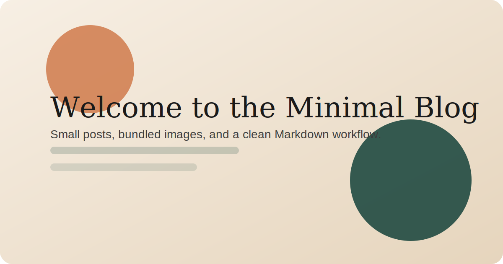

## Why this site exists

This setup is intentionally small. Every post lives in its own folder, which means you can keep the writing, cover image, screenshots, and diagrams together without any extra plumbing.

## How publishing works

Create a folder in `content/posts/`, write your `index.md`, add an image, and build the site with Hugo. That is the whole publishing loop.

## What fits here

This blog works well for:

- short essays
- coding notes
- changelogs
- tutorials with screenshots
- posts that include code snippets

## A quick code example

```js
export function slugify(value) {
  return value
    .toLowerCase()
    .trim()
    .replace(/\s+/g, "-")
    .replace(/[^\w-]+/g, "");
}
```

## One more image inside the post

Because this post uses a page bundle, local images are easy to reference:



## Closing thought

The goal here is not to manage a complicated CMS. The goal is to write, add a few assets, and publish fast.
